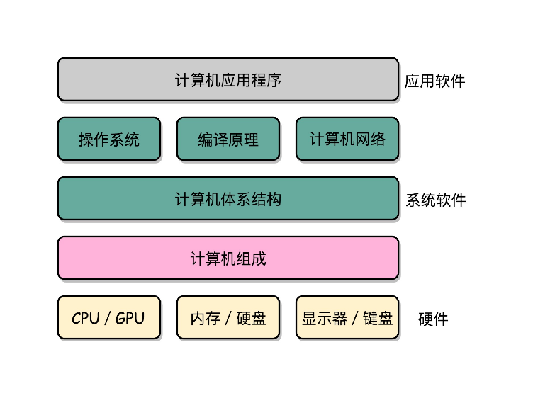

### ✍️ Tangxt ⏳ 2021-03-28 🏷️ 计算机基础

# 深入浅出计算机组成原理

> 课程：[深入浅出计算机组成原理_组成原理_计算机基础-极客时间](https://time.geekbang.org/column/intro/170)、[FAQ](./faq.md)

## ★课程介绍

1）为什么要学它？

- 在计算机专业十余门核心课程中，计算机组成原理是当之无愧的**第一课**
- 无论你想要**向上**学习计算机的底层知识，比如编译原理、操作系统、体系结构，还是想要**向下**学习数字电路、数字逻辑等内容，都要先掌握计算机组成原理。这门课不仅能让你对计算机体系有一个总纲的认识，当你选择研究更深入的领域时也大有裨益

2）如何才能学会计算机组成原理呢？

作为一名工程师，你应该明白，**学习的关键是要搞懂原理、掌握本质、解决问题**。而学习计算机组成原理，其实就是理解计算机是**怎么运作**的以及**为什么要这么运作**，在此基础上，我们才能又快又准地优化性能，提升效率。

在徐文浩看来，学习计算机组成原理，就是：

- 通过指令、计算、CPU、存储系统和 I/O，掌握整个计算机运作过程的核心知识点
- 通过拆解程序的执行过程，对计算机系统有一个全貌的了解

3）专栏模块介绍

1、入门篇

> 学习计算机组成原理，最关键的问题就是学什么、怎么学、有什么用。因此这一模块会给你一张知识地图，告诉你学习路径，并提供“从多方面提升性能”这一最终目标的实现思路。

2、原理篇

> 这一模块将为你摘出计算机组成的五大部分（控制器、运算器、存储器、输入和输出设备）中，与当下开发最相关的知识和问题，从历史视角讲清楚“是什么”，结合案例讲清楚“怎么做”。带你搞懂计算机组成原理中最核心、最重要的内容。

3、应用篇

> 理解了计算机各个组件的运作之后，最后一个模块将手把手带你实操。利用存储器层次结构设计大型 DMP 系统，并通过 Disruptor，跟你一起感受 CPU 的风驰电掣，让你真正学有所用。

## ★目录

- [01-入门篇](./01.md)

